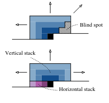
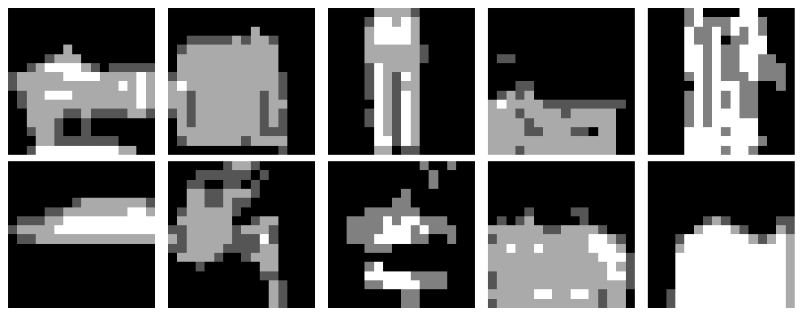

# Rapport TP PixelCNN

Dans ce notebook, on voit les modèles autorégressifs et dans celui-là on voit PixelCNN, le plus utilisé pour générer des images en autoencodeur. Ce modèle génère des images pixel par pixel en se basant sur un principe: chaque pixel est prédit en fonction des pixels précédents uniquement situés au-dessus ou à gauche, les nouveaux pixels sont donc en bas à droite.

## Méthode

### Concept Autorégressif

Le principe autorégressif en PixelCNN modélise une image x composée de pixels x_{i,j} sous la forme :

$$
p(x) = \prod_{i,j} p(x_{i,j} \mid x_{<i,j})
$$

où $x_{<i,j}$ désigne l'ensemble des pixels situés strictement avant, donc au-dessus et à gauche de la position du pixel courant (i,j).

Le modèle apprend ces distributions conditionnelles de façon explicite via des convolutions masquées.

### Convolution Masquée

Pour assurer la causalité (aucun pixel ne peut dépendre d'un pixel futur), PixelCNN utilise des convolutions masquées :

- Masque type A : utilisé uniquement pour la première couche convolutive, ce masque empêche d'utiliser le pixel actuel et les suivants.
- Masque type B : utilisé dans les couches suivantes, il permet d'utiliser le pixel actuel mais bloque les pixels futurs.

## Architecture du modèle

Le modèle PixelCNN se compose de plusieurs couches spécifiques :

- Couches convolutives masquées : garantissent l'ordre de génération strictement autorégressif
- Blocs résiduels : intègrent des skip connections permettant de mieux propager l'information et facilitent l'entraînement en réduisant les problèmes liés à la disparition du gradient

L'architecture utilisée dans le notebook est :

- Une première couche de type A
- 5 blocs résiduels avec convolutions masquées de type B
- Des couches finales permettant d'obtenir les probabilités de chaque intensité de pixel avec softmax

## Entraînement et Loss

L'entraînement de PixelCNN est réalisé par maximisation de la "vraisemblance", concrètement en minimisant la cross-entropie (log-vraisemblance négative). La loss utilisée est la suivante :

$$
\text{Cross-Entropy Loss} = - \sum_{i,j} \log p(x_{i,j} \mid x_{<i,j})
$$

Cette loss encourage le modèle à prédire précisément la distribution des intensités des pixels à chaque étape de la génération.

## Génération d'images

Pour générer des images, PixelCNN échantillonne séquentiellement chaque pixel selon la distribution conditionnelle apprise. L'utilisation d'un paramètre de température permet de contrôler la diversité des images générées (comme dans les LLM) :

- Faible température : images nettes mais moins variées
- Haute température : images plus variées mais moins réalistes

Dans notre notebook avec une température de 1 (max) et 150 epochs, on n'obtient pas un super résultat :

